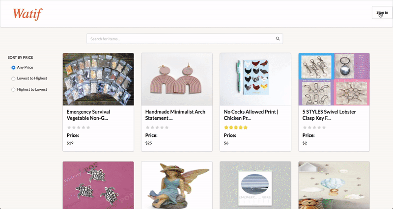
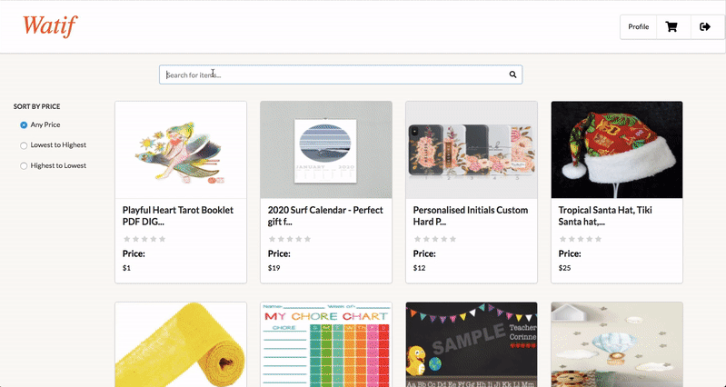
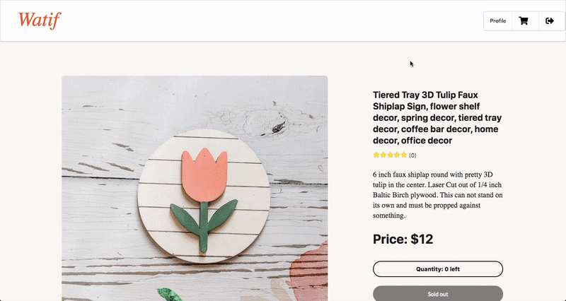
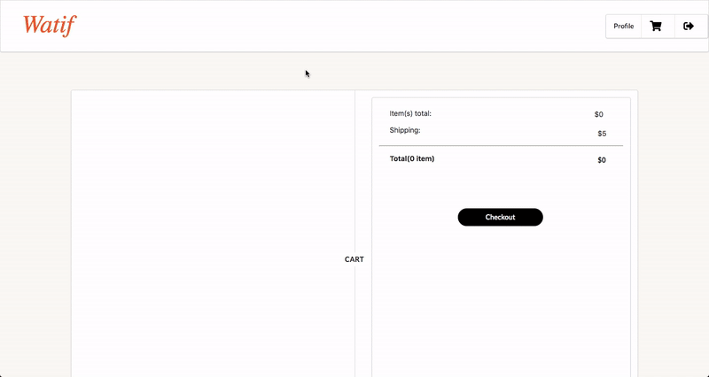
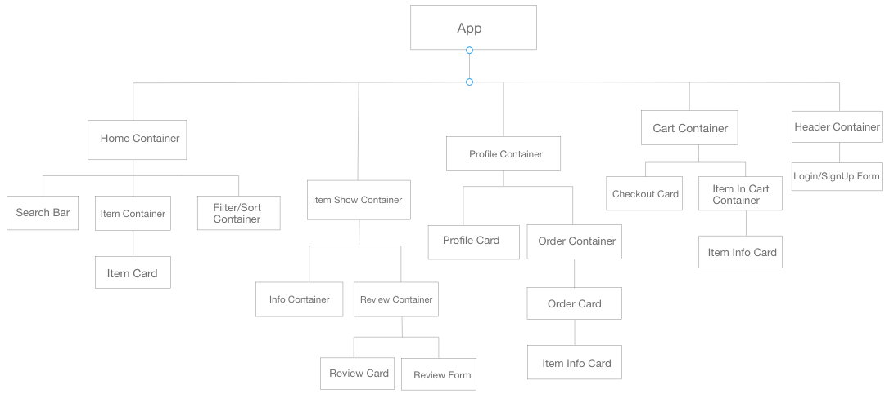
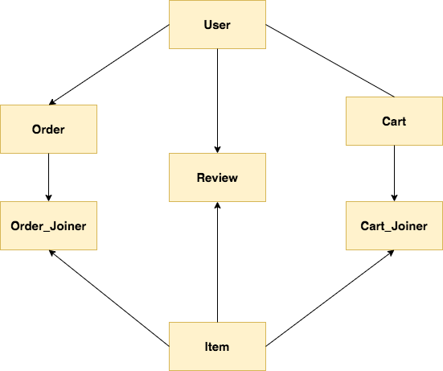

<h1 align="center">Watif 👜 ⌚️</h1>

A `React and Rails` website designed as an e-marketplace(Etsy clone) allowing creativity and uniqueness in products from handmade to vintage items and craft supplies. 

***Link to [Demo](https://www.youtube.com/watch?v=DtVUKqseap8)*** 

## Technologies

***Link to [Back End Repository](https://github.com/valentinem1/watif_backend)*** 

**Front End:** 
- React [16.12.0]
- React Router [^5.1.2] - Declarative Routing
- React Router Dom [^5.1.2] - Declarative Routing
- Redux [^7.2.0]
- React Medium Image Zoom [^4.3.0] - Allows images to work together for a “zooming” effect
- React Stripe Checkout [^2.6.3] - Service that allows users to accept payments online
- Dotenv [^8.2.0] - A zero-dependency module that loads environment variables
- Semantic UI [^0.88.2] - A UI component framework for theming websites
- CSS3 for customization

**Back End:**
- Ruby [2.6.1]
- Rails [~> 6.0.2, >= 6.0.2.1] - MVC web framework used as an API
- Bcrypt [~> 3.1.7] - Encrypt and secure user passwords
- Rack-cors - Handles Cross-Origin Resource Sharing (CORS), making cross-origin AJAX possible
- Jwt [~> 2.2] - Cryptographic signing
- PostgreSQL [>= 0.18, < 2.0] - Database
- Rest Client - Allows to save API response into the database by only fetching once
- Active Model Serializers - Serializing API routes to JSON
- Stripe API - Service that allows users to accept payments online
- Dotenv -  A zero-dependency module that loads environment variables

## Prerequisites
Before you begin, ensure you have installed the latest version of:

- Ruby
- Rails
- PostgreSQL
- React

## Installing
_Note: Without an Etsy API key, the project will not be able to have any data_ 

To launch the app you'll have to follow the following steps:

**Back End setup**
- Clone this following repo here: [Back End Repository](https://github.com/valentinem1/watif_backend) and `cd` into it
- Run `bundle install` to install all required dependencies
- Ensure you have PostgreSQL up and running
- Run `rails db:create` to create the database locally
- Run `rails db:migrate` to create the tables in the database
- Run `rails db:seed` to create the seed data
- Run `rails s -p 4000` to run the server

**Front End setup**
- Clone the repo and `cd` into it
- Run `npm install` to install all dependencies
- Run `npm start` to run the server
- Ensure it is running locally on `http://localhost:3000` to view it in the browser

## Features

Users can sign up or sign in. Upon Sign in users are taken to their profile and gain access to the add to cart functionality.  

 

User is able to see a list of items, sort them by price and click on them to be taken to the item's show page. 

 

Once on the item show page the user can add the item to their cart if the item is still available. They can also post and delete their reviews. 

 

Once the item is added to the cart the user can see it in their own cart. They can delete it or checkout. 

 

Upon checkout the user can see its order on its profile. 

## Structure

**Wireframe**

 

**Models**

 

